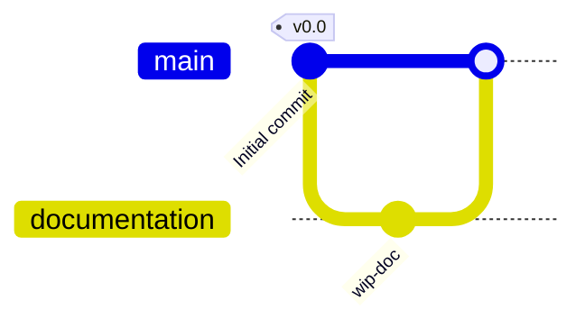
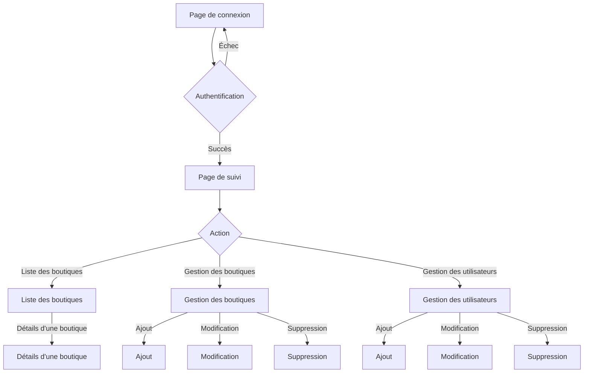
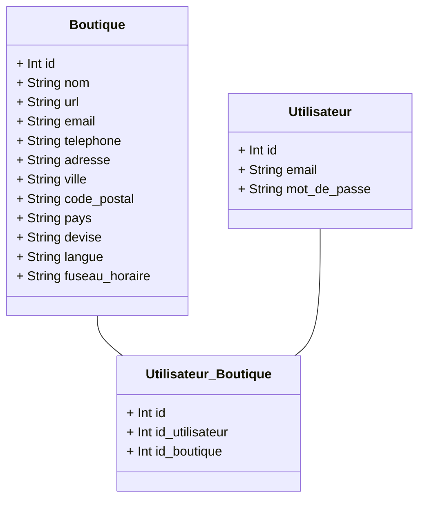

# DeployNow

DeployNow est une application web qui permet de déployer une boutique wordpress spéciale EtapesPrint avec les informations de la nouvelle boutique en configuration.

## Caractéristiques

### Pages

- Page de connexion
- Page de suivi
  - Liste des boutiques
  - Détails d'une boutique
- Page de gestion des boutiques
  - Ajout
  - Modification
  - Suppression
- Page de gestion des utilisateurs
  - Ajout
  - Modification
  - Suppression

### Base de données

